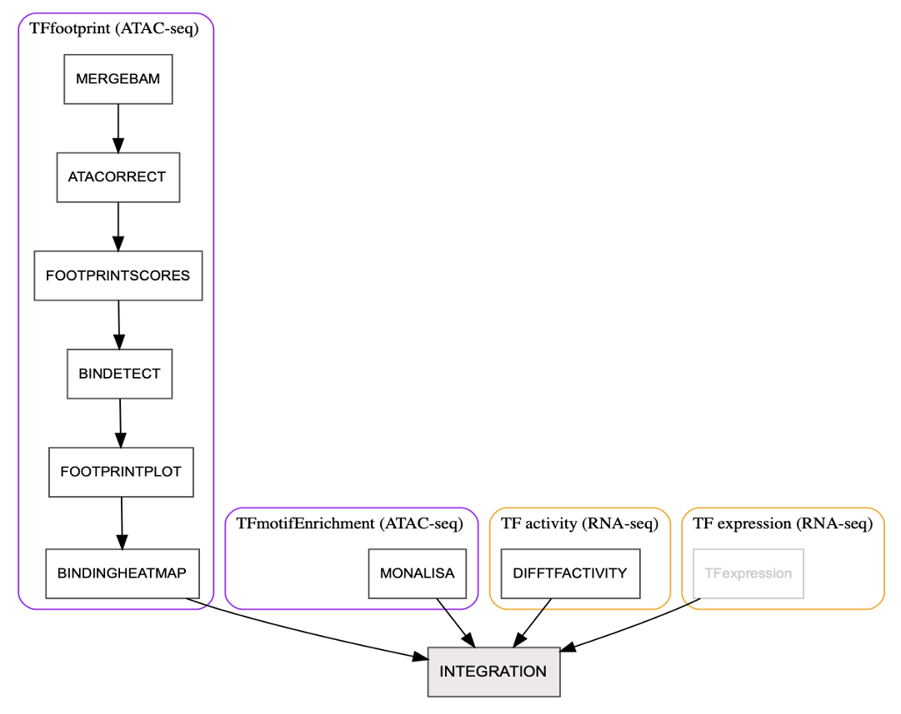

# nf-atacco

|  |  |
|------------------------------------------------------------------|-------------------------------------------------------------|

# Workflow


### Pipeline Stats
- **Modules**: 13 (BEDGRAPH, PYGTINI, TOBIAS_FOOTPRINTSCORES, COMBINEBAM, TF_Integration, TOBIAS_TFBINDINGHEATMAP, DECOUPLER_diffTFactivity_RNA, TOBIAS_ATACORRECT, pyGenomeTracks, FILTERBAM, TOBIAS_BINDETECT, MONALISA_TFmotifEnrichment, TOBIAS_FOOTPRINTPLOT)
- **Languages**: Nextflow DSL2, Groovy, R
- **Supported Platforms**: Local, HPC, Cloud
- **Execution Profiles**: Local, Docker, Apptainer, UPPMAX

### Quick Links
- [Documentation](https://github.com/Maj18/nf-atacco#readme)
- [Issues](https://github.com/Maj18/nf-atacco/issues)
- [Nextflow](https://www.nextflow.io/)
- [NBIS Epigenomics Workshop](https://nbis-workshop-epigenomics.readthedocs.io/)
- [Seqera](https://seqera.io/)

`nf-atacco` is a bioinformatics pipeline built using [Nextflow](https://www.nextflow.io/) for transcription factor inference by integrating processed ATAC-seq and RNA-seq data through multiple approaches, including TF footprinting, motif enrichment, and downstream transcriptional output analysis. The pipeline also supports integrative visualization of these results, including TF expression. In addition, it provides BAM-to-bedgraph conversion and genome track visualization for ATAC-seq downstream analysis.

*`nf-atacco` is currently in development and more modules will be added and optimizations performed in time.*


## Features

- **Reproducibility**: Ensures consistent results across runs using Nextflow.
- **Scalability**: Supports execution on local machines, HPC clusters, and cloud platforms.
- **Customizable**: Easily configurable to suit specific experimental needs.

## Requirements

- [Nextflow](https://www.nextflow.io/)
- [Docker](https://www.docker.com/) or [Apptainer](https://sylabs.io/) (optional for containerized execution)

## Installation

1. Clone the repository:
    ```bash
    git clone https://github.com/Maj18/nf-atacco.git
        - To use a special tag: git checkout v1.0.2
    ```

2. Install nf-core
    ```bash
    https://nf-co.re/docs/nf-core-tools/installation
    ```

3. Ensure dependencies are installed (e.g., Docker/Singularity).

### Offline setup

If you need to run the pipeline in an offline environment, you can download all the container images to the `conts` directory (within the nf-atacco folder). You can find the container information in the module/*/main.nf file, use singularity pull ... or docker pull ... to download the containers.

After this, run the pipeline with the `offline` profile in addition to your preferred profile(s).


### HPC profiles (SUPR NAISS Sweden only)

`pdc_kth` profile for PDC Dardel cluster
`uppmax` profile for UPPMAX cluster including auto-detect for `miarka`, `pelle`, `snowy` and `rackham` queues.

If you are running the pipeline on these HPC clusters, you can use the specific profile. These profiles are configured to use Singularity containers and has specific settings for the HPC environments.
Profiles originally written by `Pontus Freyhult (@pontus)` and adapted for the pipeline by `Aditya Singh (@addityea)`.

## Usage

Run the pipeline with the following example command:

```bash
# Directly from github
nextflow run Maj18/nf-atacco --your-params-here
# Or specify a tag or branch
nextflow run Maj18/nf-atacco -r <tag_or_branch> --your-params-here

# Or on your local clone
ataccoDir=/path/to/nf-atacco
nextflow run ${ataccoDir}/main.nf --your-params-here

# To generate genome browser trackplot for selected peaks:
nextflow run ${ataccoDir}/main.nf --project <proj id> \
    -entry ENTRY_TRACKPLOT \
    --sampleSheet <sampleSheet> --outdir <outDir> -profile uppmax,offline \
    --peakCallBedfile <peakCallBedfile_merged> \
    --geneModelGTFfile <geneModelGTFfile> \
    --regions <regions>c\
    -resume

# To generate genome browser trackplot for selected peaks from provided begraph files
nextflow run ${ataccoDir}/main.nf --project <projID> \
    -entry ENTRY_TRACKPLOT \
    --sampleSheet <sampleSheet> --outdir <outDir> -profile uppmax,offline \
    --nobg \
    --bedgraphFiles <bedgraphFiles> \
    --peakCallBedfile <peakCallBedfile_merged> \
    --geneModelGTFfile <geneModelGTFfile> \
    --regions <regions> \
    -resume

# To run TOBIAS footprinting analysis
nextflow run ${ataccoDir}/main.nf --project <projID> \
    -entry ENTRY_TOBIAS \
    --sampleSheet <sampleSheet> --outdir <outDir> -profile uppmax,offline \
    --refgenome <refgenome> \
    --group_peaks <group_peaks> \
    --peakAnnotation <peakAnnotation> \
    -resume

# To run Monalisa binned TF motif enrichment analysis
nextflow run ${ataccoDir}/main.nf --project <projID> \
    -entry ENTRY_MONALISA \
    --outdir <outDir> -profile uppmax,offline \
    --difftables <difftables> \
    --peakAnnotation <peakAnnotation> \
    -resume

# To run decoupleR differential TF activity analysis
nextflow run ${ataccoDir}/main.nf --project <projID> \
    -entry ENTRY_DIFFTFACTIVITY \
    --outdir <outDir> -profile uppmax,offline \
    --dds <dds> \
    --group_order=<group_order> \
    --currentCovariate=<currentCovariate> \
    -resume

# To integrate differential TF expression, diff TF activities, diff TF bindings, diff TF motif enrichment results
nextflow run ${ataccoDir}/main.nf --project <projID> \
    -entry ENTRY_TFINTEGRATION \
    --outdir <outDir> -profile uppmax,offline \
    --group_order <group_order> \
    --diffTFexpr_files <diffTFexpr_files> \
    --diffTFbinding_file <diffTFbinding_file> \
    --diffTFactivity_files <iffTFactivity_files> \
    --monalisa_files <monalisa_files> \
    -resume


```

You may customise the pipeline by modifying the `nextflow.config` file or by passing additional parameters in the command line.
There are some profiles available for different environments:
- 'local' for running on a local machine
- 'docker' for running with Docker
- 'arm' for specific flags for ARM architecture
- 'apptainer' for running with Apptainer
- 'UPPMAX' for running on UPPMAX cluster

## Custom Entry points

The pipeline provides several custom entry points to execute specific parts of the workflow without running the entire pipeline. To be added.

To use a specific entry point, run the pipeline with the `-entry` flag followed by the desired entry point name. For example:


## Parameters

The pipeline accepts the following parameters, which can be customized to suit your analysis needs:

- **`--sampleSheet`**: Path to the sample sheet file. *(Default: `null`)*
- **`--outdir`**: Directory where output files will be saved. *(Default: `results`)*
- **`--cpus`**: Number of threads to use for computation. *(Default: `14`)*
- **`--project`**: UPPMAX account to use for job submission. *(Default: `null`)*
- **`--memory`**: Amount of memory allocated per process. *(Default: `20 GB`)*
- **`--time`**: Maximum runtime for processes. *(Default: `10-00:00:00`)*
- **`--retry`**: Number of retries for failed processes. *(Default: `3`)*
- **`--highMemForks`**: Maximum number of high-memory forks. *(Default: `2`)*
- **`--fatMemForks`**: Maximum number of fat-memory forks. *(Default: `1`)*

Example of a sample sheet:

```csv
file,group
/path/to/BAM/sample_A.bam,Control
/path/to/BAM/sample_B.bam,Control
/path/to/BAM/sample_C.bam,Treatment
/path/to/BAM/sample_D.bam,Treatment
```

#### Optional Flags
- **`--nobg`**: skip convert bam to bedgraph, **if --nobg, then --bedgraphFiles must not be null!!!**  *(Default: `false`)*

#### MAKE_PYGT_INI parameter
- **`--bedgraphFiles`**: .bedgraph files, e.g. (A1.bedgraph A2.bedgraph) *(Default: `null`)*
- **`--peakCallBedfile`**: consensus peak .bed file *(Default: `null`)*
- **`--geneModelGTFfile`**: reference gtf file *(Default: `null`)*

#### TRACKPLOT parameters
- **`--trackIniNameSuffix`**: name suffix for the tracks.ini file needed by pyGenomeTracks *(Default: "")*
- **`--regions`**: genome regions to be plotted, e.g. 'chr1:<peakstart-1000>-<peakend+1000>;chr1_genrich_94589(MCAT)', separated by \t (tab) if multiple regions, here ´genrich_94589´ is the peak ID, ´MCAT´ is the nearest gene name *(Default: `null`)*
  
#### ATACORRECT parameters
- **`--group_peaks`**: example "Group1:peak1.bed,Group2:peak2.bed", please make sure the group names are the same as in samplesheet *(Default: `null`)*
- **`--refgenome`**: file to the reference genome e.g path_to_hg38 *(Default: `null`)*

#### BINDETECT parameters
- **`--peakAnnotation`**: path to the consensus peak annotation bed file *(Default: `null`)*

#### FOOTPRINTPLOT parameters
- **`--TFs`**: selected Transcription factors to be plotted, comma separated if multiple, e.g. 'DUX4_MA0468.1,TFDP1_MA1122.2' *(Default: `null`)*

#### MONALISA parameters
- **`--difftables`**: Paths to the differential accessibility tables separated by ';' *(Default: `null`)*
- **`--peakAnnotation`**: Path to the consensus peak annotation file *(Default: `null`)*
- **`--pfm_file`**: Path to the position frequency matrix file if you do not prefer the JASPAR pfm database *(Default: `null`)*

#### DIFFTFACTIVITY parameters
- **`--dds`**: Path to DESeq2 object (.RDS) *(Default: `null`)*
- **`--logNormCount`**: Path to the log transformed normalized count table file *(Default: `null`)*
- **`--design`**: Paths to the meta data table file *(Default: `null`)*
- **`--group_order`**: comma separated, reference group first *(Default: `null`)*
- **`--currentCovariate`**: current covariate to be differential analysis of TF activity *(Default: `null`)*

#### INTEGRATION parameters
- **`--diffTFexpr_files`**: Paths to bulk RNAseq differential expression tables (so far only support DESeq2 output), separated by ';' if multiple files *(Default: `null`)*
- **`--diffTFbinding_file`**: Path to TOBIAS BINDETECT output file (bindetect_results.xlsx)  *(Default: `null`)*
- **`--diffTFactivity_files`**: Path to differental TF activity file generated by decoupleR using the VIPER method and the Dorothea database *(Default: `null`)*
- **`--monalisa_files`**: Path to monalisa binned enrichment analysis output object (.RDS) *(Default: `null`)*


## Output

The pipeline generates the following outputs:
- bedgraph files
- genome browser track plots
- TOBIAS ATACorrect output
- TOBIAS FootprintScores output (TF footprinting scores at each position within open accessible regions)
- TOBIAS BINDetect ouput (differential TF binding results and visualization)
- TOBIAS footprint plots for each TF
- TOBIAS heatmaps of TF binding for each TF
- Monalisa output including visualization
- Differential TF activity result and visualization(on bulk RNAseq), so far only support the VIPER method and the Dorothea database
- Venndiagrms (and tables) visualizing the overlapping between differentially expressed TFs (RNAseq), differential TF acitivityt (RNAseq), differential TF binding (ATACseq) and differential TF motif enrichment (ATAC)
- Scatter plots visualizing the overlapping between differentially expressed TFs (RNAseq), differential TF acitivityt (RNAseq), differential TF binding (ATACseq) and differential TF motif enrichment (ATAC)


## Programs used

| Program | Purpose | Link |
| ------- | ------- | ---- |
| deepTools | processing, normalizing, comparing, and visualizing NGS data | [deepTools](https://deeptools.readthedocs.io/) |
| pyGenomeTracks | produce high-quality genome browser tracks | [pyGenomeTracks](https://pygenometracks.readthedocs.io/en/latest/) |
| tobias | TF footprinting analysis and visualization | [TOBIAS](https://github.com/loosolab/TOBIAS)
| monalisa | TF motif enrichment analysis | [Monalisa](https://fmicompbio.github.io/monaLisa/articles/monaLisa.html)
| decoupler | differential TF activity analysis | [decoupler](https://decoupler.readthedocs.io/en/latest/api/generated/decoupler.op.dorothea.html)


## Contributing

Contributions are welcome! Please fork the repository and submit a pull request.

## Acknowledgments

- Built with [Nextflow](https://www.nextflow.io/)
- Inspired by the [NBIS Epigenomics Workshop repo](https://nbis-workshop-epigenomics.readthedocs.io/en/latest/content/tutorials/atacseq_tutorials.html)
- Used [addityea/nf-atac](https://github.com/addityea/nf-atac.git) as a template


